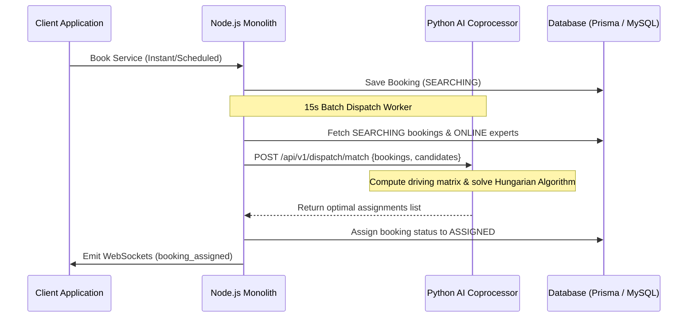

# HomeHero AI Coprocessor (`/ai-services`)

This directory houses the Python-based AI and Optimization Coprocessor for the HomeHero platform. Built using **FastAPI**, **SciPy**, and **NumPy**, this microservice offloads complex mathematical calculations, data prediction modeling, and combinatorial optimization from the Node.js monolith.

---

## 1. System Architecture

The HomeHero monolith acts as the master orchestrator, handling HTTP routing, database state management, user authentication, and WebSocket connections. It communicates with the Python AI Coprocessor internally over private HTTP requests.



---

## 2. Implemented Features

### A. Dynamic Surge Pricing (`/api/v1/pricing/surge`)
Calculates real-time price adjustment coefficients using price elasticity curves. Rather than basic rules, it applies a Sigmoid mathematical scaling function:

$$S(r) = 1.0 + \frac{1.0}{1.0 + e^{-1.5 \times (r - 1.2)}}$$

Where $r$ represents the **demand-to-supply ratio** (Active Bookings / Online Experts in a 5km radius). 
- If supply is high, the multiplier converges to `1.0`.
- If supply drops or demand spikes, the multiplier scales smoothly up to a maximum cap of `2.0`.

### B. Global Batch Matching & Dispatch Optimization (`/api/v1/dispatch/match`)
Implements the **Hungarian Algorithm (Kuhn-Munkres)** for optimal bipartite graph matching.
- **The Problem**: Assigning dispatches sequentially on a first-come-first-served basis leads to high ETAs and excessive driving distances.
- **The Solution**: Every 15 seconds, the Node.js scheduler batches pending `SEARCHING` bookings and active `ONLINE` experts and sends them to Python. 
- **The Math**: The Python service constructs a Cost Matrix where:
  $$\text{Cost}_{i,j} = \text{Distance}(B_i, E_j) \times 1.5 + (5.0 - \text{Rating}_j) \times 2.0 + \text{ActiveJobs}_j \times 3.0$$
  Then, it executes `scipy.optimize.linear_sum_assignment` to find the pairings that globally minimize overall cost.

---

## 3. Node.js Monolith Integration

The Node.js monolith accesses the Python service through the bridge service:
- File path: `backend/server/services/aiService.js`

### Methods:
- `aiService.getSurgeMultiplier(features)`: Queries pricing calculations prior to checkout.
- `aiService.solveBatchMatching(bookings, candidates)`: Offloads optimal pairing computations.

---

## 4. Development & Local Setup

### Prerequisites
- Python 3.10 or higher
- `pip` package manager

### Installation Steps
1. Navigate to the `ai-services` folder:
   ```bash
   cd ai-services
   ```
2. Create and activate a Python virtual environment:
   ```bash
   python3 -m venv venv
   source venv/bin/activate
   ```
3. Install the dependencies:
   ```bash
   pip install -r requirements.txt
   ```

### Running the Server
To start the FastAPI server locally for development:
   ```bash
   uvicorn app.main:app --reload --port 8000
   ```
Once running, you can access the interactive OpenAPI (Swagger) documentation locally at:
- **Swagger UI**: [http://localhost:8000/docs](http://localhost:8000/docs)
- **ReDoc**: [http://localhost:8000/redoc](http://localhost:8000/redoc)

### Running Code Compilation Verification
To quickly check for syntax or type errors in the python route scripts:
   ```bash
   python3 -m py_compile app/main.py app/routes/pricing.py app/routes/dispatch.py
   ```
